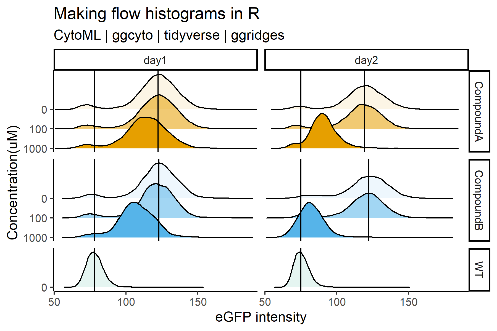

Dorien Pastoors `r format(Sys.time(), '%d %B, %Y')`
 
# Plotting flow cytometry data with GGcyto


While FLowjO is great for making and inspecting manual gating, its layout editor can be frustrating at times. However, doing the gating in Flowjo and the rest with ggplot is actually not very difficult at all as I hope to show you here!

In order to conviently be able to plot flow cytometry data with R, we would like to be able to use gating created in external software, such as Flowjo workspaces, and combine this with all the plotting options from GGPLOT. 

To for example make multiple histogram overlays according to our sample annotation:




Or make dotplots and arrange them based on sample characteristics:


For this, we use the CytoML package, which can deal with flowjo workspace formats and associated gating, and combine it with ggCyto, and ggridges.


### Citations 

Van P, Jiang W, Gottardo R, Finak G (2018). “ggcyto: Next-generation open-source visualization software for
cytometry.” _Bioinformatics_. <URL: https://doi.org/10.1093/bioinformatics/bty441>.

Finak, G. Jiang, M., Gottardo, R. (2018) CytoML for cross-platform cytometry data sharing. Cytometry A.
  93:1189-1196

# Experiment outline

In this dummy experiment, I'm analysing GFP-expressing samples with 2 treatments, 3 concentrations per treatment, and 2 timepoints. I also have a reference, GFP negative sample (wild-type, so WT). I've gated my samples on single cells.


# Preparing the workspace

```{r, echo = FALSE,message=FALSE, warning=FALSE,}
if (!requireNamespace("BiocManager", quietly = TRUE))
    install.packages("BiocManager")

BiocManager::install("ggcyto")


if (!requireNamespace("BiocManager", quietly = TRUE))
    install.packages("BiocManager")

BiocManager::install("CytoML")
```


```{r loading packages, message=FALSE, warning=FALSE, fig.height=2, fig.width=5}
library(tidyverse)

library(readxl)

library(ggpubr)

library(CytoML)

library(ggcyto)

library(ggridges)

cbPalette <- c("#999999", "#E69F00", "#56B4E9", "#009E73", "#F0E442", "#0072B2", "#D55E00", "#CC79A7")

cb_colours <- cbPalette[-1]

ggplot(data = data.frame(x = as.character(1:8), y = 1), aes(x =x , y=y, fill = x))+geom_tile()+scale_fill_manual(values = cbPalette)+theme_classic()+ggtitle("colour scheme used")


```

Here I'm specifying the names and order of the treatment factors in my design table. I also defined a named vector with the name of the cell line and what this cell line actually is, which is easier for many people to read.


# Import design table

The design table, much like with many other analysis types, specifies the role for each sample in the analysis. 
Because of the way I've chosen the treatment and timepoint names, they are put in the right order automatically (R orders factors alphabetcially). If this is not the order in which you want to plot your data, you will have to specify level order with levels = within the factor() function.

```{r read flow}
design_table <- read_excel("design_table.xlsx")

design_table$timepoint <- factor(design_table$timepoint)

design_table$treatment <- factor(design_table$treatment)

design_table$cell_type <- factor(design_table$cell_type)


design_table

```


# R gating with CytoML


I first import my workspace as XML, and then add the FCS files to this. It is possible to only import specific sample groups from your flowjo workspace as well, but you can also subset them later if you want to.

I'm importing the FCS files at gatingSet dataset.

```{r import data and design table}

# import the workspace and fcs files
workspace <- open_flowjo_xml("flowjo_workspace.wsp")

# name = 1 is to signify that all samples should be imported
gating <- flowjo_to_gatingset(workspace, name = 1, path = "fcs_files")

```


## inspect imported data

So, we have now created a gatingset. This is a data object with several attributes that we can easily access and flow cytometry experts are very familiar with

## The samples included

Using sampleNames() you can see the original filenames of the FCS files. note that I've renamed the filenames here for the purpose of making this tutorial more clear, but this is the original sample annotation that is still saved within these files. 

```{r inspect data names}
# inspect the samples imported
sampleNames(gating) 
```
## The gates

using get_pop_paths() we can access the names of the gates made in flowjo. 

```{r inspect data gates}
# inspect the gates imported and their names
gs_get_pop_paths(gating)
```
## The parameters measured

The names of the measured parameters by the flow cytometer (i.e. SSC-A) depend on the configuration of your cytometer. Here I'm accessing them with colnames(gating). I'm then renaming the FITC-A channel to "eGFP" using the markernames() function. The reason is that often you will not use the name as specified in your flow cytometer, and having a - in your variable name is very annoying!

```{r inspect data params}
#inspect the names of the parameters (FSC-A etc) as they are written in the gating dataset


marker_names <- colnames(gating)

names(marker_names) <- marker_names

marker_names["FITC-A"] <- "eGFP" # change the fitc channel to egfp

# assign the parameter names to markernames(gating) 
markernames(gating) <- marker_names

marker_names
```

# Annotating the gatingSet

The sample annotation we have saved in our design table is not yet connected to the sample annotation space in the GatingSet, with our FCS files and flowjo workspace. In order to add this information to our gatingSet, we will first extract the exisitng sample information, and then overwrite it with our sample information + the information in the design table. 


```{r add sample annotation to gatingSet}

annot_flowjo <- pData(gating) # this extracts all the sample names in the gating object

annot_flowjo$rownames <- rownames(annot_flowjo)

annot_flowjo <- merge(annot_flowjo, design_table, by.x = "name", by.y = "original_filename")

rownames(annot_flowjo) <- annot_flowjo$rownames

annot_flowjo <- annot_flowjo%>%select(-rownames)

head(annot_flowjo)

# assign the merged dataframe back into the gating object and you can now use it to subset
pData(gating) <- annot_flowjo
```


# Extract statistics from the samples

You might want to know the mean fluorescent intensity and use it as a reference for your plot. So this is what i'm extracting here. You can also extract other variables such as the % of parent, much like you can do in Flowjo. See the documentation of gs_pop_get_stats() for more options.


```{r extract MFI}
# extract the MFI for all variables

MFI_per_sample <- gs_pop_get_stats(gating, nodes = "/cells/single_cells1/single_cells2", type = pop.MFI)

annot_flowjo$rownames <- rownames(annot_flowjo)

# add sample annotation to the mfi per sample

MFI_per_sample <- merge(MFI_per_sample, annot_flowjo, by.x = "sample",  by.y = "rownames")

MFI_per_sample <- MFI_per_sample%>%select(sample, pop, eGFP, name, cell_type, treatment, concentration, timepoint)

# filter the control samples (concentration = 0) for upper reference line

Mean_control_samples <- MFI_per_sample%>%dplyr::filter(concentration == 0)


# filter the WT  samples (cell type = WT for the lower reference line)
Mean_wt <- Mean_control_samples%>%dplyr::filter(cell_type == "WT")%>%select(eGFP_WT = eGFP, timepoint)


# merge control and WT
Mean_control_samples <- merge(Mean_wt, Mean_control_samples, by = "timepoint", all.y = TRUE)


```

# Histograms

First, we need to select the samples and gates we want to plot from. For this, we can use subset() to specify a sample selection, and gs_pop_get_data to identify a gate we want to plot from. 

In this case we will use all the samples in the workspace, so I've commented out the subset() function but you can see how you would do it if you wanted to select a subset of samples


```{r, fig.width = 6, fig.height=4, message=FALSE, results=FALSE}
# sample_selection <- subset(gating, treatment != "CompoundB" & concentration > 0)
#sample_selection <- gs_pop_get_data(sample_selection, "/cells/single_cells1/single_cells2")

# select the gate you want to plot
sample_selection <- gs_pop_get_data(gating, "/cells/single_cells1/single_cells2")
```

Then, the plot!
It's quite long but its essentially a ggplot and has all the same functions as a normal ggplot. The data we added to the gatingSet with pData is available for you to use as a variable, and this is actually suprisingly easy. 

```{r, fig.width = 6, fig.height=4, message=FALSE, results=FALSE, warning=FALSE}
ggcyto(sample_selection, aes(x = eGFP ))+
  
  # create density histograms
  geom_density_ridges(aes(y = factor(concentration, levels = rev(levels(factor(concentration)))), 
                          fill = treatment, 
                   alpha = concentration))+

  scale_fill_manual(values = cb_colours)+
  
  # create plotting grid
  facet_grid(treatment~timepoint, 
             scales = "free_y", space = "free_y")+
  
  # create vertical reference lines: the untreated conditions
    geom_vline(data = Mean_control_samples%>%dplyr::filter(treatment != "WT"), 
             aes(xintercept = eGFP))+
  # create vertical reference lines for the WT condition
      geom_vline(data = Mean_control_samples, 
            aes(xintercept = eGFP_WT))+
  
  
  theme_classic2()+
  
  ggtitle("Making flow histograms in R",
          subtitle = "CytoML | ggcyto | tidyverse | ggridges")+

  
  xlab("eGFP intensity") + ylab("Concentration(uM) ")+
  theme(legend.position = "none")+
  scale_y_discrete(expand = expansion(add = c(0.2, 2)))


ggsave(filename =  "density_histograms.png")
ggsave(filename =  "density_histograms.pdf")

```

# Dotplots

Using facet_grid you can also make easy dotplots across mutliple variables.
Here I'm first selecting my day1 samples and then plotting the dotplots side-by-side

```{r, fig.width = 4.5, fig.height=4, message=FALSE, results=FALSE, warning=FALSE}
 sample_selection <- subset(gating, timepoint != "day1")
sample_selection <- gs_pop_get_data(sample_selection, "/cells/single_cells1/single_cells2")


ggcyto(sample_selection, aes(x = eGFP, y =  `SSC-A` ))+
  
  # create density histograms
  geom_point(aes(color = treatment), alpha = 0.2, size = 0.01)+

  scale_color_manual(values = cb_colours)+
  # create plotting grid

  facet_grid( factor(concentration) ~ treatment, 
             scales = "free_y", space = "free_y")+
  

  theme_classic2()+
 
  ggtitle("Making flow dotplots in R",
          subtitle = "CytoML | ggcyto | tidyverse | ggridges")+

  
  xlab("eGFP intensity") + ylab("SSC-A")+
  theme(legend.position = "none")


ggsave(filename =  "dotplots.png")
ggsave(filename =  "dotplots.pdf")

```

